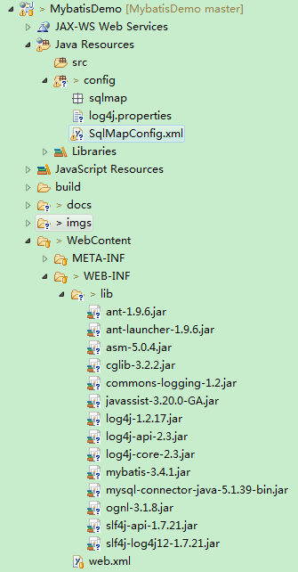

# 002.入门程序

## 一、需求

* 根据用户id（主键）查询用户信息

* 根据用户名称模糊查询用户信息

* 添加用户

* 删除用户

* 更新用户

## 二、环境

* mybatis-3.4.1.jar

* ant-1.9.6.jar
* ant-launcher-1.9.6.jar
* asm-5.0.4.jar
* cglib-3.2.2.jar
* commons-logging-1.2.jar
* javassist-3.20.0-GA.jar
* log4j-1.2.17.jar
* log4j-api-2.3.jar
* log4j-core-2.3.jar
* ognl-3.1.8.jar
* slf4j-api-1.7.21.jar
* slf4j-log4j12-1.7.21.jar

* mysql-connector-java-5.1.39-bin.jar

## 三、log4j.properties

* 从Mybatis用户指南（p90）中拷贝log4j.properties的配置

		# Global logging configuration
		# 开发环境下日志级别设置为DEBUG
		# 生产环境下日志级别设置为INFO或ERROR
		log4j.rootLogger=DEBUG, stdout
		# MyBatis logging configuration...
		log4j.logger.org.mybatis.example.BlogMapper=TRACE
		# Console output...
		log4j.appender.stdout=org.apache.log4j.ConsoleAppender
		log4j.appender.stdout.layout=org.apache.log4j.PatternLayout
		log4j.appender.stdout.layout.ConversionPattern=%5p [%t] - %m%n

* properties文件显示中文问题

## 四、工程结构

## 五、SqlMapConfig.xml

		<?xml version="1.0" encoding="UTF-8" ?>
		<!DOCTYPE configuration
		PUBLIC "-//mybatis.org//DTD Config 3.0//EN"
		"http://mybatis.org/dtd/mybatis-3-config.dtd">
		<configuration>
			<!-- 和spring整合后 environments配置将废除-->
			<environments default="development">
				<environment id="development">
				<!-- 使用jdbc事务管理，由MyBatis控制事务-->
					<transactionManager type="JDBC" />
				<!-- 数据库连接池，由MyBatis管理  -->
					<dataSource type="POOLED">
						<property name="driver" value="com.mysql.jdbc.Driver" />
						<property name="url" value="jdbc:mysql://localhost:3306/mybatis?characterEncoding=utf-8" />
						<property name="username" value="root" />
						<property name="password" value="mysql" />
					</dataSource>
				</environment>
			</environments>	
		</configuration>

## 六、根据用户id（主键）查询用户信息

### 1.创建po类

### 2.映射文件

* 映射文件命名：

User.xml(原iBatis命名)，

mapper代理开发映射文件名称叫XXXMapper.xml，比如：UserMapper.xml、ItemsMapper.xml

* 在映射文件中配置sql语句

		<?xml version="1.0" encoding="UTF-8" ?>
		<!DOCTYPE mapper
		PUBLIC "-//mybatis.org//DTD Mapper 3.0//EN"
		"http://mybatis.org/dtd/mybatis-3-mapper.dtd">
		<!-- 
			namespace命名空间，作用就是对sql进行分类话管理
			注意：使用mapper代理方式开始，namespace就有特殊重要的作用
		-->
		<mapper namespace="test">
			<!-- 
				在映射文件中配置很多sql语句
				通过select执行数据库查询
				id：用来标识映射文件中的sql，
					将sql语句封装到mappedStatement对象中，称为statement的id
				parameterType：指定输入参数类型，这里指定int型
				#{}表示一个占位符
				#{id}其中的id用来接收输入的参数，参数名就是id，
					如果输入参数是简单类型，#{}中的参数名可以任意，
				resultType：指定sql输出结果中单条记录所映射的Java对象类型
			-->
			<select id="findUserById" parameterType="int" resultType="com.jimmy.mybatis.po.User">
				SELECT * FROM USER WHERE id = #{id}
			</select>
		</mapper>

### 3.在SqlMapConfig.xml中加载User.xml映射文件

		<!-- 加载映射文件 -->
		<mappers>
			<mapper resource="sqlmap/User.xml"/>
		</mappers>

### 4.程序编写

		package com.jimmy.mybatis.first;
		
		import java.io.IOException;
		import java.io.InputStream;
		
		import org.apache.ibatis.io.Resources;
		import org.apache.ibatis.session.SqlSession;
		import org.apache.ibatis.session.SqlSessionFactory;
		import org.apache.ibatis.session.SqlSessionFactoryBuilder;
		import org.junit.Test;
		
		import com.jimmy.mybatis.po.User;
		
		public class MyBatisFirst {
		
			//根据id查询用户信息，得到一条记录
			@Test
			public void findUserByIdTest() throws IOException {
				
				//MyBatis的配置文件
				InputStream inputStream = Resources.getResourceAsStream("SqlMapConfig.xml");
				
				//创建会话工厂SqlSessionFactory，需要传入MyBatis的配置文件信息
				SqlSessionFactory sqlSessionFactory = new SqlSessionFactoryBuilder().build(inputStream);
				
				//通过会话工厂得到会话SqlSession
				SqlSession sqlSession = sqlSessionFactory.openSession();
				
				//通过会话操作数据库
				//第一个参数：映射文件中statement的id，等于namespace.statement的id
				//第二个参数：指定与映射文件中parameterType类型相匹配的的参数
				//sqlSession.selectOne应该返回与映射文件中resultType类型相匹配的对象
				User user = sqlSession.selectOne("test.findUserById", 1);
				
				System.out.println(user);
				
				//释放资源
				sqlSession.close();
			}
		
		}

## 七、根据username模糊查询用户信息

### 1.映射文件

* 在映射文件中配置sql语句

		<!-- 
			根据用户名称模糊查询用户信息，可能返回多条结果
			resultType：指定sql输出结果中单条记录所映射的Java对象类型
			${}表示拼接sql串，将接收到的参数不加任何修饰拼接到sql中，可能引起sql注入
			${value}其中的value用来接收参数，如果传入的类型是简单类型，${}中只能使用value		
		 -->
		<select id="findUserByName" parameterType="java.lang.String" resultType="com.jimmy.mybatis.po.User">
			SELECT * FROM USER WHERE username LIKE '%${value}%'
		</select>

### 2.程序编写

		//根据username模糊查询用户信息，得到多条记录
		@Test
		public void findUserByNameTest() throws IOException {
			
			//MyBatis的配置文件
			InputStream inputStream = Resources.getResourceAsStream("SqlMapConfig.xml");
			
			//创建会话工厂SqlSessionFactory，需要传入MyBatis的配置文件信息
			SqlSessionFactory sqlSessionFactory = new SqlSessionFactoryBuilder().build(inputStream);
			
			//通过会话工厂得到会话SqlSession
			SqlSession sqlSession = sqlSessionFactory.openSession();
			
			//通过会话操作数据库
			//第一个参数：映射文件中statement的id，等于namespace.statement的id
			//第二个参数：指定与映射文件中parameterType类型相匹配的的参数
			//sqlSession.selectList应该返回与映射文件中resultType类型相匹配的对象
			List<User> users= sqlSession.selectList("test.findUserByName", "张");
			
			System.out.println(users);
			
			//释放资源
			sqlSession.close();
		}

## 八、小结

* parameterType

在映射文件中通过parameterType指定输入参数的类型

* resultType

在映射文件中通过resultType指定输出结果的类型

* #{}

表示一个占位符

* ${}

表示一个拼接符号，会引起sql注入，所以不建议使用

* selectOne

表示查询出一条记录进行映射

* selectList

表示查询出多条记录进行映射

## 八、添加用户

### 1.映射文件

* 在映射文件中配置statement

		<!-- 
			添加用户
			parameterType：指定输入参数类型是pojo
			#{}中指定pojo的属性名，接收到pojo对象的属性，MyBatis通过OGNL获取对象的属性
		 -->
		<insert id="insertUser" parameterType="com.jimmy.mybatis.po.User">
			INSERT INTO user (id, username, birthday, sex, address) VALUE (#{id}, #{username}, #{birthday}, #{sex}, #{address})
		</insert>

### 2.程序编写

		//添加用户
		@Test
		public void insertUserTest() throws IOException {
			
			//MyBatis的配置文件
			InputStream inputStream = Resources.getResourceAsStream("SqlMapConfig.xml");
			
			//创建会话工厂SqlSessionFactory，需要传入MyBatis的配置文件信息
			SqlSessionFactory sqlSessionFactory = new SqlSessionFactoryBuilder().build(inputStream);
			
			//通过会话工厂得到会话SqlSession
			SqlSession sqlSession = sqlSessionFactory.openSession();
			
			//插入的User对象
			User user = new User();
			user.setUsername("Jimmy");
			user.setBirthday(new Date());
			user.setSex("1");
			user.setAddress("湖北武汉");
	
			sqlSession.insert("test.insertUser", user);
			
			//提交事务
			sqlSession.commit();
			
			//释放资源
			sqlSession.close();
		}

### 3.自增主键返回

* 在映射文件中配置

		<!-- 
			添加用户
			parameterType：指定输入参数类型是pojo
			#{}中指定pojo的属性名，接收到pojo对象的属性，MyBatis通过OGNL获取对象的属性
		 -->
		<insert id="insertUser" parameterType="com.jimmy.mybatis.po.User">
			<!-- 
				将插入数据的主键返回，返回到user对象中
				SELECT LAST_INSERT_ID()：得到刚insert进去记录的主键值，只适用于自增主键
				keyProperty：将查询到的主键值设置到parameterType指定的对象的id属性中
				resultType：指定SELECT LAST_INSERT_ID()的结果类型
				order：指定SELECT LAST_INSERT_ID()相对于insert语句的执行顺序
			 -->
			<selectKey keyProperty="id" resultType="java.lang.Integer" order="AFTER">
				SELECT LAST_INSERT_ID()
			</selectKey>
			INSERT INTO user (id, username, birthday, sex, address) VALUE (#{id}, #{username}, #{birthday}, #{sex}, #{address})
		</insert>

### 4.非自增主键返回

* 使用mysql的uuid()函数生成主键，需要修改表中id字段类型为String，长度设置成35位

思路：
先通过uuid()查询到主键，将主键输入到sql语句中。
对于insert语句uuid()要先执行

		<!-- 
			使用mysql的uuid()生成主键
			执行过程：
				首先通过uuid()得到主键，将主键设置到user对象的id属性中
				其次在insert执行时，从user对象中取出id属性值
		 -->
		<selectKey keyProperty="id" resultType="java.lang.String" order="BEFORE">
			SELECT UUID()
		</selectKey>

## 九、删除用户

* 在映射文件中配置

		<!-- 
			删除用户
			根据id删除用户，需要输入id
		 -->
		<delete id="deleteUser" parameterType="java.lang.Integer">
			DELETE FROM USER WHERE id = #{id}
		</delete>

## 十、更新用户

* 在映射文件中配置

		<!-- 
			根据id更新用户
			需要传入用户的id
			需要传入用户的更新信息
			parameterType：指定user对象，包括id和更新信息，注意：id必须存在
			#{id}：从输入user对象中获取id属性值
		 -->
		<update id="updateUser" parameterType="com.jimmy.mybatis.po.User">
			UPDATE USER SET username = #{username}, birthday = #{birthday}, sex = #{sex}, address = #{address} WHERE id = #{id}
		</update>

