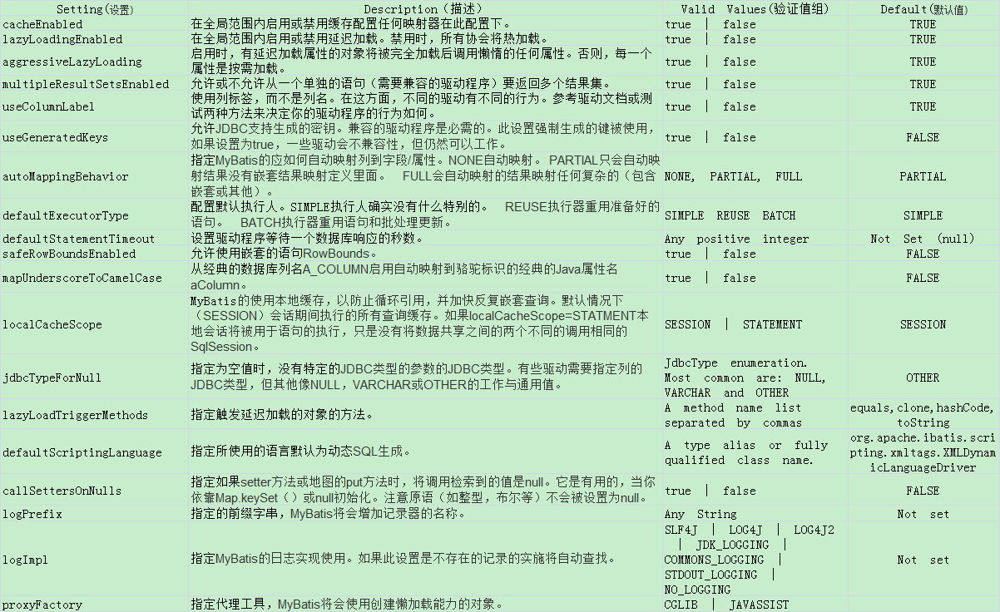
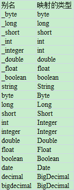
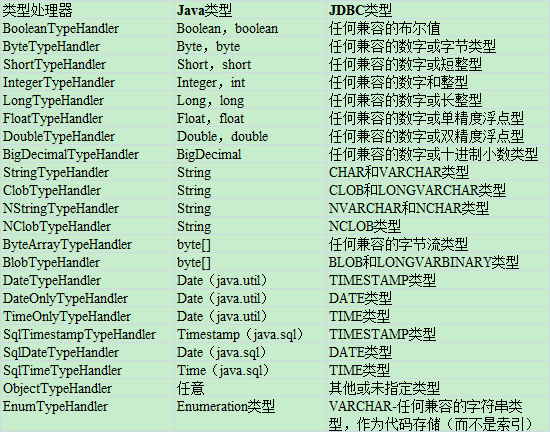

# 005.SqlMapperConfig.xml

	SqlMapConfig.xml中配置的内容和顺序如下：
	
	properties（属性）
	settings（全局配置参数）
	typeAliases（类型别名）
	typeHandlers（类型处理器）
	objectFactory（对象工厂）
	plugins（插件）
	environments（环境集合属性对象）
		environment（环境子属性对象）
			transactionManager（事务管理）
				dataSource（数据源）
	mappers（映射器）

## 一、properties属性

		<!-- 加载属性文件 -->
		<properties resource="db.properties"></properties>
		<!-- 和spring整合后 environments配置将废除 -->
		<environments default="development">
			<environment id="development">
				<!-- 使用jdbc事务管理，由MyBatis控制事务 -->
				<transactionManager type="JDBC" />
				<!-- 数据库连接池，由MyBatis管理 -->
				<dataSource type="POOLED">
					<property name="driver" value="${jdbc.driver}" />
					<property name="url" value="${jdbc.url}" />
					<property name="username" value="${jdbc.username}" />
					<property name="password" value="${jdbc.password}" />
				</dataSource>
			</environment>
		</environments>

* MyBatis将按照下面的顺序来加载属性：

1.在properties元素体内定义的属性首选被读取

2.然后会读取properties元素中resource或url加载的属性，它会覆盖已读取的同名属性

* 建议：

不要在properties元素体内添加任何属性值，只将属性值定义在properties文件中

在properties文件中定义属性名要有一定的特殊性，比如jdbc.driver

## 二、settings全局配置参数

MyBatis框架在运行时可以调整一些运行参数。比如：开启二级缓存、开启延迟加载

全局配置参数将会影响MyBatis的运行行为

## 三、typeAliases别名

### 1.需求

在mapper.xml中，定义很多的statement，statement需要parameterType指定输入参数的类型、需要resultType指定输出结果的类型。

如果在指定类型时输入类型的全限定名，不方便开发，可以针对parameterType或resultType指定的类型定义一些别名，在mapper.xml中通过定义别名，方便开发。

### 2.MyBatis默认别名

### 3.自定义别名

		<!-- 自定义别名 -->
		<typeAliases>
			<!-- 
				单个别名定义
				type：类的全限定名
				alias：别名 
			 -->
			<typeAlias type="com.jimmy.mybatis.po.User" alias="user"/>
			
			<!-- 
				批量别名定义
				指定包名，MyBatis自动扫描包中的po类，自动定义别名，别名就是类名（首字母大写或小写都可以）
			 -->
			 <package name="com.jimmy.mybatis.po"/>
		</typeAliases>

## 四、typeHandlers类型处理器

MyBatis中通过typeHandlers完成jdbc类型和java类型的转换

通常情况下，MyBatis提供的类型处理器满足日常的需求，不需要自定义

MyBatis提供的类型处理器：

## 五、mapper映射配置

### 1.通过resource加载单个映射文件

		<!-- 通过resource一次加载一个映射文件 -->
		<mapper resource="mapper/UserMapper.xml"/>

### 2.批量加载mapper（推荐使用）

		<!-- 
			批量加载mapper
			指定mapper接口的包名，MyBatis自动扫描包内的所有mapper接口进行加载
			遵循一些规范：
				使用mapper代理方式开发dao
				mapper接口类名和mapper.xml映射文件名保持一致，且在同一个目录中
				
		 -->
		<package name="com.jimmy.mybatis.mapper"/>
	