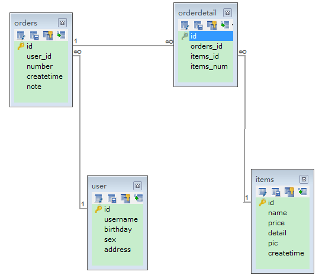

# 009.高级映射

## 一、数据模型分析思路

* 1.每张表记录的数据内容

分模块对每张表记录的内容进行熟悉，相当于你学习系统需求（功能）的过程。

* 2.每张表重要的字段设置

非空字段、外键字段

* 3.数据库级别表与表之间的关系

外键关系

* 4.表与表之间的业务关系

在分析表与表之间的业务关系时一定要建立在某个业务意义基础上

## 二、数据模型分析

## 三、一对一查询

### 1.需求

查询订单信息，关联查询创建订单的用户信息

### 2.sql语句

确定查询主表：订单表

确定查询关联表：用户表

由于订单表有一个外键（user_id）,通过外键关联查询用户表只能查询出一条记录，可以使用内连接。

SELECT orders.*,user.username, user.birthday,user.sex,user.address FROM orders, USER WHERE orders.user_id = user.id

### 3.创建pojo

将上边的sql查询结果映射到pojo中，pojo中必须包括所有列名

原始的Orders.java不能映射全部的字段，需要新创建pojo

		package com.jimmy.mybatis.po;
		
		import java.util.Date;
		
		//通过此类映射订单和用户查询的结果，让此类集成包括字段较多的pojo类
		public class OrderCustom extends Orders {
			
			//添加用户属性
			private String username;
			private Date birthday;
			private String sex;
			private String address;
			
			public String getUsername() {
				return username;
			}
			public void setUsername(String username) {
				this.username = username;
			}
			public Date getBirthday() {
				return birthday;
			}
			public void setBirthday(Date birthday) {
				this.birthday = birthday;
			}
			public String getSex() {
				return sex;
			}
			public void setSex(String sex) {
				this.sex = sex;
			}
			public String getAddress() {
				return address;
			}
			public void setAddress(String address) {
				this.address = address;
			}
			
		}

### 4.mapper.xml(resultType)

		<?xml version="1.0" encoding="UTF-8" ?>
		<!DOCTYPE mapper
		PUBLIC "-//mybatis.org//DTD Mapper 3.0//EN"
		"http://mybatis.org/dtd/mybatis-3-mapper.dtd">
		<mapper namespace="com.jimmy.mybatis.mapper.OrdersMapperCustom">
		
			<!-- 查询订单信息关联用户信息 -->
			<select id="findOrdersUser" resultType="OrdersCustom">
				SELECT orders.*,user.username, user.birthday,user.sex,user.address FROM orders, user WHERE orders.user_id = user.id
			</select>
			
		</mapper>

### 5.mapper接口

		package com.jimmy.mybatis.mapper;
		
		import java.util.List;
		
		import com.jimmy.mybatis.po.OrdersCustom;
		
		public interface OrdersMapperCustom {
			
			public List<OrdersCustom> findOrdersUser() throws Exception;
			
		}

### 6.mapper.xml(resultMap)

		<!-- 
			订单查询关联用户信息的resultMap
			将整个查询的结果映射到Orders中
		 -->
		<resultMap type="Orders" id="ordersResultMap">
			<!-- 配置映射订单信息 -->
			<id column="id" property="id"/>
			<result column="user_id" property="user_id"/>
			<result column="number" property="number"/>
			<result column="createtime" property="createtime"/>
			<result column="note" property="note"/>
			<!-- 
				配置映射关联的用户信息
				<association>：用于映射关联查询单个对象的信息
				property：将关联查询的用户信息映射到Orders中的哪个属性
				javaType：属性的类型
			 -->
			<association property="user" javaType="com.jimmy.mybatis.po.User">
				<id column="user_id" property="id"/>
				<result column="username" property="username"/>
				<result column="birthday" property="birthday"/>
				<result column="sex" property="sex"/>
				<result column="address" property="address"/>
			</association>
		</resultMap>

### 7.resultType和resultMap实现一对一查询小结

* resultType：使用resultType实现较为简单，如果pojo中没有包括查询出来的列，需要增加列名对应的属性，即可完成映射。如果没有对查询结果的特殊要求建议使用resultType。

* resultMap：需要单独定义resultMap，实现有点麻烦，如果有对查询结果的特殊要求，使用resultMap可以完成将关联查询映射到pojo的属性中。

* resultMap可以实现延迟加载，resultType则不行。

## 四、一对多查询

### 1.需求

查询订单及订单明细的信息

### 2.sql语句

确定查询主表：订单表

确定查询关联表：订单明细表

在一对一查询基础上添加订单明细表的关联即可

		SELECT 
		  orders.*,
		  user.username,
		  user.birthday,
		  user.sex,
		  user.address,
		  orderdetail.id orderdetail_id,
		  orderdetail.items_id,
		  orderdetail.items_num
		FROM
		  orders,
		  USER,
		  orderdetail
		WHERE orders.user_id = user.id AND orders.id = orderdetail.orders_id

### 3.mapper.xml

		<!-- 
			订单及订单明细的resultMap
			使用extends继承，不用再配置订单信息和用户信息的映射
		 -->
		<resultMap type="Orders" id="ordersAndDetailsResultMap" extends="ordersResultMap">
		
			<!-- 
				订单明细信息
				一个订单关联多条明细，要使用<collection>进行映射
				<collection>：对关联查询到的多条记录映射到集合对象中
				property：将关联查询到的多条记录映射到Orders的哪个属性中
				ofType：指定映射到List集合属性中pojo的类型
			 -->
			<collection property="orderdetails" ofType="com.jimmy.mybatis.po.Orderdetail">
				<id column="orderdetail_id" property="id"/>
				<result column="id" property="ordersId"/>			
				<result column="items_id" property="itemsId"/>
				<result column="items_num" property="itemsNum"/>
			</collection>
			
		</resultMap>

### 4.resultMap实现一对多查询小结

MyBatis使用resultMap的<collection>对关联查询的多条记录映射到一个List集合属性中

## 五、多对多查询

### 1.需求

查询用户及用户购买商品信息

### 2.sql语句

查询主表：用户表

关联表：由于用户和商品没有直接关联关系，通过订单和订单明细进行关联，所有关联表：订单表、订单明细表、商品表

		SELECT 
		  orders.*,
		  user.username,
		  user.birthday,
		  user.sex,
		  user.address,
		  orderdetail.id orderdetail_id,
		  orderdetail.items_id,
		  orderdetail.items_num,
		  items.name item_name,
		  items.price item_price,
		  items.detail item_detail
		FROM
		  orders,
		  USER,
		  orderdetail,
		  items
		WHERE orders.user_id = user.id AND orders.id = orderdetail.orders_id AND items.id = orderdetail.items_id

### 3.mapper.xml

		<!-- 
			查询用户及购买的商品
		 -->
		<resultMap type="User" id="userAndItemResultMap">
			<!-- 用户信息 -->
			<id column="user_id" property="id"/>
			<result column="username" property="username"/>
			<result column="birthday" property="birthday"/>
			<result column="sex" property="sex"/>
			<result column="address" property="address"/>
			<!-- 订单信息 -->
			<collection property="orders" ofType="Orders">
				<id column="id" property="id"/>
				<result column="user_id" property="user_id"/>
				<result column="number" property="number"/>
				<result column="createtime" property="createtime"/>
				<result column="note" property="note"/>
				<!-- 订单明细 -->
				<collection property="orderdetails" ofType="Orderdetail">
					<id column="orderdetail_id" property="id"/>
					<result column="id" property="ordersId"/>
					<result column="items_id" property="itemsId"/>
					<result column="items_num" property="itemsNum"/>
					<!-- 商品信息 -->
					<association property="items" javaType="Items">
						<id column="items_id" property="id"/>
						<result column="item_name" property="name"/>
						<result column="item_price" property="price"/>
						<result column="item_detail" property="detail"/>
					</association>
				</collection>
			</collection>
		</resultMap>

## 六、resultMap小结

resultType：
作用：
	将查询结果按照sql列名pojo属性名一致性映射到pojo中。
场合：
	常见一些明细记录的展示，比如用户购买商品明细，将关联查询信息全部展示在页面时，此时可直接使用resultType将每一条记录映射到pojo中，在前端页面遍历list（list中是pojo）即可。

resultMap：
	使用association和collection完成一对一和一对多高级映射（对结果有特殊的映射要求）。

association：
作用：
	将关联查询信息映射到一个pojo对象中。
场合：
	为了方便查询关联信息可以使用association将关联订单信息映射为用户对象的pojo属性中，比如：查询订单及关联用户信息。
	使用resultType无法将查询结果映射到pojo对象的pojo属性中，根据对结果集查询遍历的需要选择使用resultType还是resultMap。
	
collection：
作用：
	将关联查询信息映射到一个list集合中。
场合：
	为了方便查询遍历关联信息可以使用collection将关联信息映射到list集合中，比如：查询用户权限范围模块及模块下的菜单，可使用collection将模块映射到模块list中，将菜单列表映射到模块对象的菜单list属性中，这样的作的目的也是方便对查询结果集进行遍历查询。
	如果使用resultType无法将查询结果映射到list集合中。

